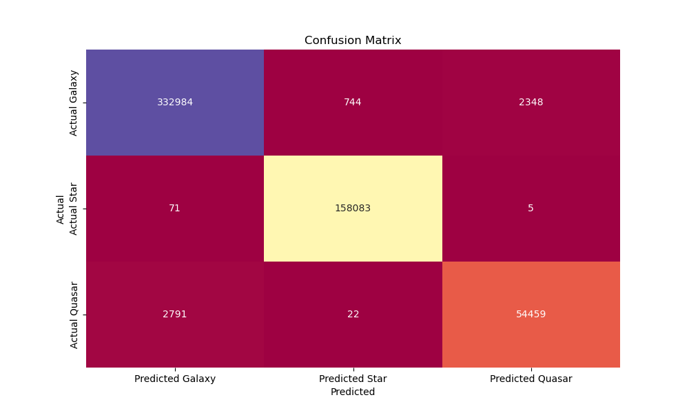
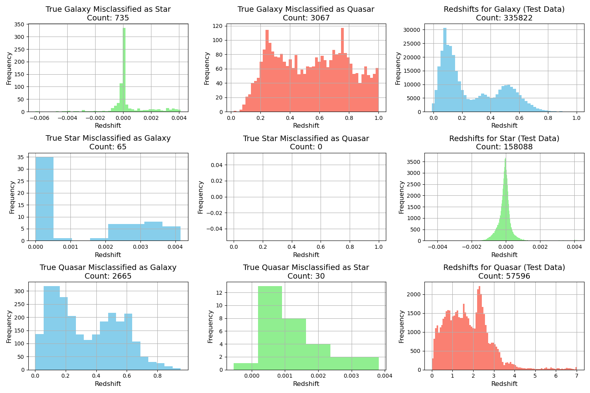

# Stellar Object Classification - Project README 
[Link to Jupyter Notebook](https://github.com/seanhulseman/stellar-object-classification---larger-attempt/blob/main/stellar_object_id.ipynb)
## Problem Statement
The field of astronomy relies heavily on the accurate and efficient classification of celestial objects. The Sloan Digital Sky Survey (SDSS) provides a rich dataset with columns such as ultraviolet (u), green (g), red (r), near-infrared (i), infrared (z), 'class', and 'redshift'. The challenge is to develop a robust classification model that accurately identifies the class of celestial objects based on their spectral features. The goal of this project is to create a model that accurately distinguishes between types of stellar objects from Sloan Digital Sky Survey (SDSS) data to help physicists more finely distinguish quasars, galaxies, and stars.

# Executive Summary
## Problem Overview
The classification of celestial objects is a fundamental task in astronomy, and the SDSS dataset, comprising 2.2 million data points, provides an opportunity to enhance the accuracy and efficiency of this process. The project aims to leverage machine learning techniques to develop a classification model for celestial objects based on their spectral features and astronomer-determined redshifts.

## Goals and Objectives
* Develop a machine-learning model for classifying celestial objects.
* Achieve a classification accuracy of at least 98% on the test dataset.
* Learn something new about quasars. I recently read an article [here](https://www.smithsonianmag.com/smart-news/astronomers-discover-the-brightest-known-object-in-the-universe-shining-500-trillion-times-as-bright-as-the-sun-180983815/) that discusses the discovery a quasar that was initially thought to be a star due to its immense brightness and it got me inspired to do an astrophysics related data science project

## Data Dictionary 
| Feature    | Type    | Dataset | Description                                        |
|------------|---------|---------|----------------------------------------------------|
| u          | float   | SDSS    | Ultraviolet filter in the photometric system              |
| g          | float   | SDSS    |  Green filter in the photometric system              |
| r          | float   | SDSS    | Red filter in the photometric system              |
| i          | float   | SDSS    | Near Infrared filter in the photometric system        |
| z          | float   | SDSS    | Infrared filter in the photometric system        |
| class      | string  | SDSS    | Class of celestial object (e.g., star, galaxy, quasar) |
| redshift   | float   | SDSS    | Redshift value usually indicates the object's distance from Earth.  Redshift is a constant multiple to all wavelengths of the spectrum emitted by stellar objects|
| ra         | float (0-360 degrees)  | SDSS    |This is similar to longitude on Earth but projected onto the celestial sphere.|
| dec        | float (0-90 degrees)  | SDSS    |This is similar to latitude on Earth but projected onto the celestial sphere.|
## Methodology
The project involves the following steps:

1. Data exploration and understanding of the SDSS dataset obtained through a SQL query of the SkyServerDR9. Below is an example of the information available vie the SkyServerDR9. I queried specific 'objid' values and could do the same for each object in this set.

2. Data preprocessing, including handling missing values and encoding categorical variables.
3. Model selection and training using appropriate machine learning algorithms.
4. Evaluation of the model on a held-out test dataset.
## Key Findings
* The developed model achieves a classification accuracy of 99% on the unseen test data.
* The accuracy of the model by class: Quasars (95%), then Galaxies (99%), and finally Stars (>99%) 

* Notably, there is a significant difference in redshift for quasars and galaxies misclassified by the random forest model. See image below.
## Error Analysis
Misclassified objects are identified by comparing the predicted classes with the true classes. The misclassified objects, along with their predicted and true classes, are stored in a dataframe for further analysis. Histograms are plotted to visualize each class's redshift distribution of misclassified objects.
## Redshift Anomaly
During the analysis, it was observed that the random forest model misclassified certain quasars, and further investigation revealed a notable difference in redshift values for these instances. This finding may provide evidence supporting the anomaly in lower-than-expected redshifts for certain quasars, a phenomenon that cannot be currently explained by existing astronomical models.
## Comparing the distributions of redshift values for model-generated misclassification 

## Concluding thoughts
* Without knowing any laws of physics, the model predicted the class of 551,506 stellar objects {Galaxy: 0, Star: 1, Quasar:2} correctly for 544,944 of the objects.
* I documented several objects that have a change in classification and am curious when none of the other data changes in my query except for the class, what is the root cause of that?
* Making better use of the position in the sky may prove useful when taking into account gravitational redshift and other relativistic effects.
* This is a big dataset to train and I am weary to try hyperparameter tuning in this case but it may improve the model. 
* Removing the 'objid' from the dataframe may marginally increase performance but it was useful for me to look at the real images of the tough objects to classify

## Next Steps
1. Explore additional feature engineering techniques to enhance model performance.
2. Investigate the underlying causes of the redshift anomaly in misclassified quasars.
3. Collaborate with astronomers and domain experts to gather insights for further refinement.

By taking these next steps, the project can continue to evolve and provide even more accurate and meaningful results in the field of astronomy, potentially contributing to our understanding of celestial phenomena.